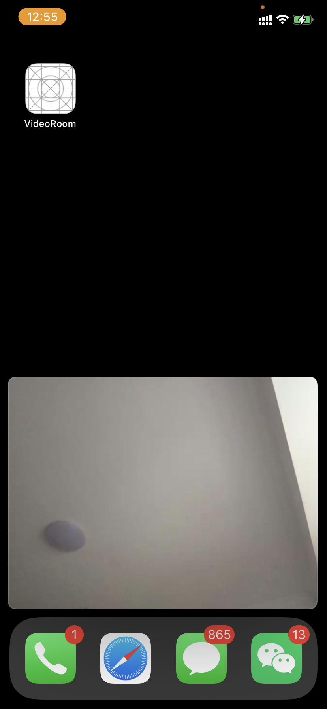

# About
An iOS example project for janus videoroom-plugin, written in Swift.

## Features

- 1 to many video conference;
- camera sharing;
- screen sharing(currently video only(h.264), raw buffer without any modifications);
- ~~interact with GPUImage(under developing...)~~
- `AVSampleBufferDisplayLayer` based renderer support(can use PiP mode in iOS 15).

## Screenshots

## Notice

- This repo is for sharing my learning WebRTC & janus video room experience, welcome to share yours.
- This is an example project and far from a demo, it is not fully test yet, welcome to create an issue.

## Steps

- Connect signaling server first(specific in `Config.signalingServerURL`), 
for example: `wss://janus.conf.meetecho.com/ws` or 
build your own janus sever(try [this repo](https://github.com/Meonardo/janus-docker) to build janus docker image on your machine).
- Input room number(such as: 1234).
- Hit `Join Room`, will joined the video room if nothing goes wrong.

## External Libraries & their licenses
- [WebRTC](https://github.com/Meonardo/WebRTC.git).
- [Starscream](https://github.com/daltoniam/Starscream).
- [Codextended](https://github.com/JohnSundell/Codextended). 
- [Alertift](https://github.com/sgr-ksmt/Alertift).
- [ProgressHUD](https://github.com/relatedcode/ProgressHUD)
